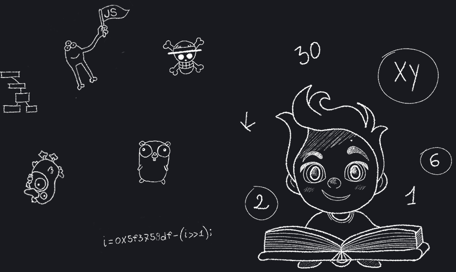

    

###

#### Hi There!

#### I'am PaCo, a Software Engineer with solid experience in Web Development.

Feel free to visit my [website](https://contepas.github.io) or reach out to me via [LinkedIn](https://www.linkedin.com/in/pasqualeconte) or [Email](mailto:conte.pas@me.com).

Thank you for visiting my profile!

###

